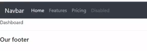

# Github

깃북에 대해 알아볼게요. 대표적인 전자책, 문서 매뉴얼을 만드는 곳이에요.   

## 회원가입

#### 1. 말 그대로 회원 가입을 진행해 주시면 되요.

2. 우측 상단의 Go to Dashboard 버튼을 눌러주세요. 

3. 우측 상단의 Create a new space라는 버튼을 눌러 주세요.   
여기서는 TITLE 설정과 COLOR, 공개와 비공개 설정이 중요해요.   
다른 무엇보다 **TITLE설정**을 통해서 본인의 **웹페이지 제목**과 **URL의 마지막 이름**까지 지정해주는 부분이니. **본인이 원하는 이름을 지어주시면 되요. 물론 추후 변동도 가능해요.**

하단의 CREATE 버튼을 눌러주세요. 

1이라는 저만의 웹페이지가이 생성되었다고 보면되요.

#### Visibility mode 설정\(private &lt;- -&gt; public\)

혹여 다른 pribate로 설정하셨다면 왼쪽 사이드바의 share버튼을 클릭하고 visibility에서 public으로 재설정해 줄수 있으니 참고하세요.  

####  자신의 웹페이지 주소 URL 보이나요? 마지막에 본인이 지정한 titile이름도 보이네요. 사실 현재 작업하는 화면은 관리자 화면 페이지에요. 복사해서 새로운 창에 저 url을 실행해 볼게요.

